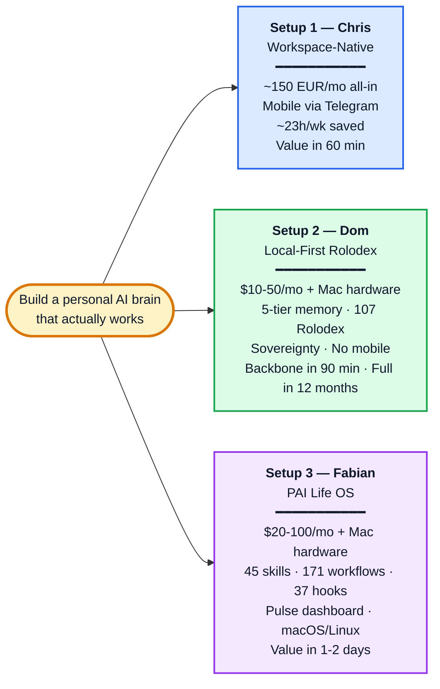
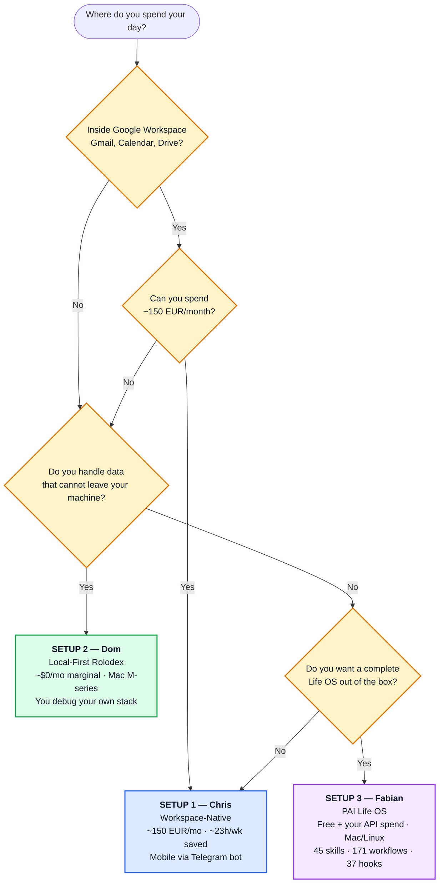

# EO AI Productivity Exchange

> **The Open-Source AI Productivity Series for EO Operators.**
> Your Pain → Our Skill → Continuous.

A continuous, audience-driven series where EO members surface real AI-setup pains, and the community ships verified solutions. Hosted by [Christoph Erler](https://erlerventures.org), Dominik Raute (CTO JustWatch), and Fabian Gless, EO Berlin.

---



---

## Which setup is best for you?

> **TL;DR — for ~80% of EO operators, the answer is Setup 1 (Workspace-Native, Chris).** You already live in Workspace, you want value in 30 days not 12 months, you want mobile, and you can afford ~150 EUR/mo. The other two are for specific edge cases (regulated data → Dom, opinionated Life OS lover on Mac → Fabian).

The honest one-question filter:



**Why Setup 1 is the default for the EO audience:** of 118 audience registrations across 53 chapters at Event #1, **69% already use Claude** and the dominant pain cluster was *"Setup itself / time to configure"* — the Workspace-Native path is the lowest-friction path to a working brain in <60 minutes. The other two are honest counterfactuals: Dom's local-first proves you *can* do this at $0/mo if you have 12 months of engineering time, Fabian's PAI proves you *can* skip the build entirely if you accept Miessler's opinionated framework.

---

## All three setups, side by side

Three operator-level setups demoed at Event #1 (2026-05-11). **Same problem** — build a personal AI brain that actually works in production. **Three different operator-level answers.** Pick the one closest to how you already work, fork it tonight, run it tomorrow.

| | **Setup 1 — Workspace-Native** | **Setup 2 — Local-First Rolodex** | **Setup 3 — PAI Life OS** |
|---|---|---|---|
| **Operator** | Christoph Erler (EO Berlin) | Dominik Raute (CTO JustWatch) | Fabian Gless (EO Berlin) runs Daniel Miessler's PAI |
| **Stack** | Claude Code + 31 MCP + 19 skills + 125 memory + 7 crons + Telegram | Vanilla OpenClaw + custom 5-tier memory + Rolodex + local LLMs on Mac | PAI v5.0.0: 45 skills + 171 workflows + 37 hooks + Pulse dashboard |
| **Cost / month (honest, steady-state)** | ~150 EUR all-in (Claude Pro 20 + AWS Lightsail 20 + APIs ~110) | **$10-50/mo** cloud Claude escalations + electricity (NOT $0 — see below) | **$20-100/mo** PAI workflow API spend (depends on usage) |
| **Hardware up-front** | Whatever you already have (Mac/Linux/Windows+WSL) | Mac M-series + 32GB+ RAM ≈ **3-5k EUR once** if you don't have one | Mac M-series recommended ≈ **3-5k EUR once** if you don't have one |
| **3-year TCO (no new hardware needed)** | ~5.4k EUR | ~$360-1.800 | ~$720-3.600 |
| **3-year TCO (incl. ~$4k Mac amortized)** | ~5.4k EUR | ~$4.360-5.800 | ~$4.720-7.600 |
| **Mobile?** | ✅ Telegram bot | ❌ Desktop-first | Dashboard at `localhost:31337` |
| **Platform** | Mac / Linux / Windows+WSL | Mac M-series (Linux possible, theoretical) | macOS / Linux only |
| **Tracked time saved** | ~23h/wk | similar order, $0 marginal cost | tied to PAI's 7-phase Algorithm |
| **Time to first working skill** | 60 min | 90 min for backbone, 12 months for full Rolodex | 30 min install + 1-2 days configuration |
| **Pick if** | You live in Gmail/Calendar/Drive all day | You handle data that cannot leave your machine | You want opinionated framework, not blank slate |
| **Skip if** | You need full local sovereignty | You want value in 30 min | You're on Windows |
| **Detailed spec** | **→ [setups/chris-claude-code.md](setups/chris-claude-code.md)** | **→ [setups/dom-rolodex.md](setups/dom-rolodex.md)** | **→ [setups/fabian-personal-ai.md](setups/fabian-personal-ai.md)** |

> **The honest cost insight.** "$0 marginal" or "free" headlines hide hardware + escalation API costs. Once you amortize a Mac and add cloud Claude calls for hard reasoning, **all three setups land in roughly the same 3-year TCO bracket** for someone who needs to buy hardware. **The real differentiator is time-to-first-value** (60 min vs 1-2 days vs 12 months) and what you optimize for (mobile vs sovereignty vs opinionated framework).

### What each setup ships, in plain terms

**🔵 Setup 1 — Chris (Workspace-Native).** The "AI as infrastructure replaces a team I would have hired" path. Claude Code wired into Google Workspace via 31 MCP servers, 19 reusable skills (8 of them in [`/skills/`](skills/)), 125 memory files routed by a ~50-line CLAUDE.md, mobile via a Telegram bot on AWS Lightsail Frankfurt. ~23h/wk saved on a tracked 8-week sample. Replaces ~1.5 FTE (80-110k EUR/yr) at a 45-60x cost ratio. Personal opportunity cost reclaimed: ~270k EUR/yr. → [Read the full spec](setups/chris-claude-code.md) — origin, 4-layer brain, 8 forkable skills with names, 7 cron jobs, anti-AI voice rules, 30-day rollout plan, troubleshooting.

**🟢 Setup 2 — Dom (Local-First Rolodex).** The "sovereignty over convenience" path. Vanilla OpenClaw as backbone, custom 5-tier memory (`System Prompt > Bootstrap > On-Demand > Search Index > Raw Archive`), a Rolodex of 107 person dossiers, 1.183 files indexed across 5.735 vectors / 11 collections, all running on local models on a Mac. 2-5 second queries. **Real cost: $10-50/mo cloud Claude escalations + electricity, plus Mac M-series hardware (~3-5k EUR once if you don't have one).** Built over 12 months from scratch. The agent that remembers. → [Read the full spec](setups/dom-rolodex.md) — 5-tier architecture, what Dom shared at the event, honest struggles, when this is right (and when it is not).

**🟣 Setup 3 — Fabian (PAI Life OS).** The "complete opinionated Life OS out of the box" path. [Daniel Miessler's PAI v5.0.0](https://github.com/danielmiessler/Personal_AI_Infrastructure) (12.100+ stars, MIT) — 45 skills, 171 workflows, 37 hooks, a Pulse dashboard at `localhost:31337`, the Telos / ISA / DA conceptual framework. One-line install. macOS / Linux only. **Real cost: PAI itself is free + MIT, but plan $20-100/mo cloud Claude API for the workflows that escalate, plus Mac hardware (~3-5k EUR once if you don't have one).** → [Read the full spec](setups/fabian-personal-ai.md) — what you get, the Telos step that matters, honest struggles, why this matters as a reference architecture.

> **Brand new to GitHub or AI tooling?** Start at [`START-HERE.md`](START-HERE.md) for the 3-step path (fork → clone → first skill). No jargon, screenshots from official GitHub Docs.

> **Don't know what Claude Code, MCP, or Skills are?** Plain-English glossary at [`resources/glossary.md`](resources/glossary.md).

> **Looking for a fix to a specific pain?** [`SOLUTIONS.md`](SOLUTIONS.md) — 11 documented solutions, one per audience pain cluster from 118 registrations.

---

## What this repo is

A living solution-pipeline for the AI-productivity pains that founders and operators actually face. Every event ends with a `git push`, not just „thanks for listening". Every audience pain becomes either a documented solution, a working skill, or both.

**Three pillars:**
1. **Audience-driven curriculum.** Pains come from registration data and live Slido, not speaker egos.
2. **Open-source solutions.** Every challenge gets a skill / template / playbook here.
3. **Continuous cadence.** 30-90 days between events, depending on market velocity and community demand.

---

## What shipped at Event #1 (2026-05-11)

11 in-depth solutions covering all 10 pain clusters identified from **118 audience registrations across 53 EO chapters and 4 continents**. See [SOLUTIONS.md](SOLUTIONS.md) for the full index and [AUDIENCE-ANALYSIS](events/01-2026-05-11-setup-trap/AUDIENCE-ANALYSIS.md) for the verified pain breakdown.

### Live decks

- **Joint deck** &middot; [chris1928a.github.io/eo-ai-exchange/events/01-2026-05-11-setup-trap/slides.html](https://chris1928a.github.io/eo-ai-exchange/events/01-2026-05-11-setup-trap/slides.html) (22 slides)
- **Chris's deep dive** &middot; [chris-demo.html](https://chris1928a.github.io/eo-ai-exchange/events/01-2026-05-11-setup-trap/chris-demo.html) (44 slides)
- **Q&A backup** &middot; [qa-deck.html](https://chris1928a.github.io/eo-ai-exchange/events/01-2026-05-11-setup-trap/qa-deck.html) (15 slides, all 12 Slido questions with sources)

### Solution highlights

- [Setup Trap Diagnostic, 1-pager](solutions/setup-itself/setup-trap-diagnostic.md) &middot; the 3 questions to escape the trap
- [30-Min aiOS Blueprint](solutions/setup-itself/30-min-aios-blueprint.md) &middot; zero to working setup in 30 min
- [OpenClaw Honest Assessment](solutions/openclaw-honest/openclaw-honest-assessment.md) &middot; incl. CVE-2026-25253 + 5 alternatives
- [GDPR Claude Checklist DACH](solutions/security-gdpr/gdpr-claude-checklist-dach.md) &middot; incl. EU AI Act August 2026 deadline
- [MCP Cookbook](solutions/integration-mcp/mcp-cookbook.md) &middot; 10 essential MCP servers for founders
- [Team Rollout Playbook](solutions/team-adoption/team-rollout-playbook.md) &middot; 90-day plan with BBVA case study
- Plus 5 more, one per pain cluster, in [`solutions/`](solutions/)

---

## Referenced architectures

External open-source patterns we recommend forking, reading, or learning from.

### Daniel Miessler &middot; Personal AI Infrastructure (PAI)

[github.com/danielmiessler/Personal_AI_Infrastructure](https://github.com/danielmiessler/Personal_AI_Infrastructure) &middot; MIT &middot; 12.100+ stars

A Life Operating System for AI. PAI captures who you are, what you care about, and where you are trying to go, and then helps you move toward it. Three layers:

- **PAI** itself, the OS (skills, memory, the Algorithm, your Telos, identity files)
- **Pulse**, the Life Dashboard at `localhost:31337`
- **The DA** (Digital Assistant), the voice you talk to

v5.0.0 ships **45 skills, 171 workflows, 37 hooks**, Algorithm v6.3.0 (Current State → Ideal State across seven phases), the **ISA** primitive (universal "ideal state" articulation), and structural privacy via containment zones. macOS and Linux supported (Windows not yet). One-line install: `curl -sSL https://ourpai.ai/install.sh | bash`.

**Why we reference it:** PAI is the opinionated counterpoint to Chris's workspace-native setup and Dom's local-first memory. It is featured as **Demo 3 at Event #1**, presented by Fabian Gless. Companion deep dive: [events/01-2026-05-11-setup-trap/fabian-demo-pai.md](events/01-2026-05-11-setup-trap/fabian-demo-pai.md).

---

## Repository structure

```
eo-ai-exchange/
├── README.md                    ← you are here
├── START-HERE.md                ← beginner's 3-step path (fork → clone → first skill)
├── SOLUTIONS.md                 ← master index of all solutions, by pain cluster
├── CONTRIBUTING.md              ← how to PR your own skill or solution
│
├── events/                      ← one folder per event
│   └── 01-2026-05-11-setup-trap/
│       ├── README.md            ← event-specific intro
│       ├── slides.html          ← joint deck for the live event (22 slides)
│       ├── chris-demo.html      ← Chris's solo deep dive (44 slides)
│       ├── qa-deck.html         ← Q&A backup deck (15 slides)
│       ├── fabian-demo-pai.md   ← PAI demo companion (1200 words)
│       ├── QA-CHEATSHEET.md     ← panel cheatsheet, plain Markdown
│       └── AUDIENCE-ANALYSIS.md ← anonymized pain breakdown, 118 registrants
│
├── setups/                      ← three operator setups, fork-ready
│   ├── chris-claude-code.md     ← Workspace-native, ~150 EUR/mo, 23h/wk saved
│   ├── dom-rolodex.md           ← Local-first 5-tier + Rolodex, ~$0/mo
│   └── fabian-personal-ai.md    ← Daniel Miessler's PAI v5, complete Life OS
│
├── skills/                      ← 8 forkable starter SKILL.md files from Event #1
│   ├── morning-brief/           ← Daily 7am brief (2.25h/wk saved)
│   ├── diarize-person/          ← 1-page stakeholder dossier
│   ├── draft-by-channel/        ← Voice-locked drafts per channel (2.7h/wk)
│   ├── weekly-review/           ← Friday 7-day review (90→10 min)
│   ├── memory-curator/          ← Weekly memory hygiene cron
│   ├── audit-process/           ← Domain example: process diagnostics
│   ├── sales-script-rewriter/   ← Domain example: sales call coaching
│   └── property-pricing/        ← Domain example: daily revenue management
│
├── templates/                   ← starter foundation files
│   ├── CLAUDE.md.template       ← Project-level instructions, ~50 lines
│   └── memory-templates/        ← user_about, feedback_voice, hat, curator rules
│
├── solutions/                   ← solutions grouped by pain cluster (10 clusters)
│   ├── tool-overload/           ← Tool Overload Diagnostic
│   ├── setup-itself/            ← Setup Trap Diagnostic + 30-Min aiOS Blueprint
│   ├── agents/                  ← Agent Reliability Checklist
│   ├── team-adoption/           ← Team Rollout Playbook (90-day)
│   ├── integration-mcp/         ← MCP Cookbook (10 essential servers)
│   ├── openclaw-honest/         ← OpenClaw Honest Assessment (incl CVE)
│   ├── industry-healthcare/     ← Healthcare Scheduling Stack
│   ├── security-gdpr/           ← GDPR Claude Checklist DACH
│   ├── pace-keeping-up/         ← Weekly AI Filter
│   └── time-learning/           ← 60-Day Founder Onboarding
│
├── resources/
│   └── glossary.md              ← plain-language defs (Claude Code, MCP, Skills, etc.)
│
└── speakers/                    ← speaker pipeline + alumni
```

---

## Cadence philosophy

**Cadence over Quarterly. Solutions over Slides.**

Events fire on triggers, not on a calendar:
- Major model release → next event in 30 days, focused on what changed
- Major tool / MCP standard shift → next event in 30 days, focused on what to build
- Audience pain cluster maturing (10+ submissions on a new topic) → next event in 60 days, industry/vertical spotlight
- Default cadence (no trigger) → every 90 days, solution review + new cycle

Hosts check triggers monthly. The next event is announced when there is something genuinely worth meeting for.

---

## How to contribute

Three ways to contribute:

1. **Submit a pain.** Open an issue tagged `pain` describing what you are stuck on. We aggregate these for the next event.
2. **Submit a solution.** Open a PR with a markdown file or a runnable skill in the appropriate folder. See [CONTRIBUTING.md](CONTRIBUTING.md) for format.
3. **Apply to speak at the next event.** See [speakers/README.md](speakers/README.md).

All contributors are credited in `speakers/alumni/`.

---

## Chatham House Rule

All event content is shared under Chatham House Rule: share the information, not the attribution. This applies to the GitHub repo too: if you reference a discussion from an event, do not cite specific speakers without their explicit permission.

---

## Hosts

- **Christoph Erler** (EO Berlin), former co-founder & COO at ComX (exit). Founder of [Erler Ventures](https://erlerventures.org).
- **Dominik Raute** (EO Berlin), CTO of JustWatch.
- **Fabian Gless** (EO Berlin), founder of Die Tierversicherer (AI-enabled insurance broker, performance marketing roots). Personal AI Infrastructure (PAI) operator.

---

## License

All solutions in this repo are released under MIT License. Use, modify, share. Attribution appreciated, not required.

---

*Last updated: 2026-05-14 (Event #1 wrapped, 11 solutions + 3 setups + glossary live, 118 registrations across 53 EO chapters).*
