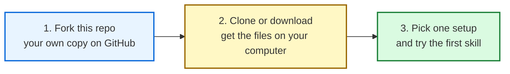

# Start Here

> **For people who have never used GitHub before.**
> If `git` and `clone` and `fork` sound like a foreign language, this is the right page.

If you already use GitHub daily, skip this and go straight to [`README.md`](README.md) or [`SOLUTIONS.md`](SOLUTIONS.md).

---

## What is this repo, in one paragraph

This is a free library of working AI setups, written by founders for founders. Three people (Chris, Dom, Fabian) showed how they run AI day to day at [Event #1](events/01-2026-05-11-setup-trap/README.md). Their setups, the slides, the failures, the fixes, all of it lives here. You can read it, copy it, change it, or fork the entire thing into your own GitHub account and make it yours.

---

## The 3-step path



That is the whole journey. Maybe 15 minutes if you have never done this before. Each step is below.

---

## Step 1, Fork this repo (2 minutes)

A **fork** is your personal copy of someone else's GitHub repo. You can change it, break it, rebuild it. The original is unaffected.

1. Make sure you are signed in at [github.com](https://github.com)
2. Open this repo's main page: [github.com/chris1928a/eo-ai-exchange](https://github.com/chris1928a/eo-ai-exchange)
3. Click the **Fork** button in the top-right corner of the page
4. Leave the defaults, click **Create fork**
5. Done, you now have `github.com/<your-username>/eo-ai-exchange`

> **Visual reference:** GitHub's official one-page guide with screenshots is here: [docs.github.com/.../fork-a-repo](https://docs.github.com/en/pull-requests/collaborating-with-pull-requests/working-with-forks/fork-a-repo). Use it if anything below is unclear.

> **No GitHub account?** Create one free at [github.com/signup](https://github.com/signup). Two minutes.

---

## Step 2, Get the files on your computer (5 minutes)

Pick **one** of two paths.

### Path A, GitHub Desktop (recommended for non-developers)

GitHub Desktop is a free app. No terminal, no commands. Click and done.

1. Download it: [desktop.github.com](https://desktop.github.com)
2. Install + sign in with your GitHub account
3. **File → Clone Repository → Your fork** → pick a folder → **Clone**
4. The files are now on your machine

Official walkthrough with screenshots: [docs.github.com/.../cloning-and-forking-repositories-from-github-desktop](https://docs.github.com/en/desktop/adding-and-cloning-repositories/cloning-and-forking-repositories-from-github-desktop)

### Path B, Terminal (if you already have `git` installed)

```bash
git clone https://github.com/<your-username>/eo-ai-exchange.git
cd eo-ai-exchange
```

If `git` is not installed: [git-scm.com/downloads](https://git-scm.com/downloads).

### Path C, Just download a ZIP (no install at all)

1. On your fork's page, click the green **Code** button
2. **Download ZIP**
3. Unzip on your computer

This works fine for reading the content. It is harder to update later, if that matters, use Path A.

---

## Step 3, Pick one setup and start (5 minutes to the first win)

Three setups are documented in [`setups/`](setups/). Pick the one closest to how you already work.

| If you live in... | Pick this | What you get |
|---|---|---|
| Google Workspace, mobile-first, fine paying ~150 EUR/mo | [`setups/chris-claude-code.md`](setups/chris-claude-code.md) | Workspace-native, 23h/wk saved, 31 MCP tools, 19 skills |
| Mac, want full sovereignty, $0/mo, comfortable with terminals | [`setups/dom-rolodex.md`](setups/dom-rolodex.md) | Local-first 5-tier memory + Rolodex of 107 people, $0/mo |
| Mac/Linux, want a complete opinionated Life OS out of the box | [`setups/fabian-personal-ai.md`](setups/fabian-personal-ai.md) | Daniel Miessler's PAI v5: 45 skills, 171 workflows, 37 hooks (agent-agnostic) |

Each setup file has:
- What it is (in plain English)
- What you need installed
- Step-by-step to your first working skill
- What hurts (the honest struggles section)
- Where to read more

---

## Don't know what Claude Code, MCP, or Skills are?

We wrote a plain-English glossary: [`resources/glossary.md`](resources/glossary.md). Read it once, then come back.

---

## Common errors people hit

| Error | Probably means |
|---|---|
| "Permission denied (publickey)" when cloning | You need to set up SSH keys, OR clone via HTTPS instead. Use HTTPS, it is easier. |
| "command not found: git" | Git is not installed. Use GitHub Desktop instead (Step 2 Path A). |
| "command not found: claude" after installing Claude Code | Restart your terminal. If still broken, check the Claude Code install docs: [docs.claude.com/claude-code](https://docs.claude.com/en/docs/claude-code/overview) |
| Forked the repo but cannot find it | Top-right of github.com → click your avatar → **Your repositories**. It is there. |

---

## Where to ask for help

1. **Open an issue** on the original repo: [github.com/chris1928a/eo-ai-exchange/issues](https://github.com/chris1928a/eo-ai-exchange/issues). Use the `pain` template (see [CONTRIBUTING.md](CONTRIBUTING.md)).
2. **EO members:** post in your chapter's AI channel. Several event registrants offered to help.
3. **Stuck on git itself, not on us:** [GitHub's beginner guide](https://docs.github.com/en/get-started/start-your-journey/hello-world) covers everything from zero.

---

## Once you have one setup working

Three things to do next, in order:

1. **Read [`SOLUTIONS.md`](SOLUTIONS.md)**, 11 documented solutions to the most common pain clusters. Pick the one that matches your biggest pain.
2. **Read [`solutions/openclaw-honest/openclaw-honest-assessment.md`](solutions/openclaw-honest/openclaw-honest-assessment.md)**, the honest assessment of where things break in production. Save yourself a week.
3. **Submit your own pain or solution** as a Pull Request. See [CONTRIBUTING.md](CONTRIBUTING.md). Every event ships solutions for what the community asked for.

---

## Why fork instead of just bookmarking?

- Forking gives you your own copy you can edit. Bookmark = read-only.
- When you change a setup file with your own credentials, paths, or notes, you do not lose those changes when the original updates.
- Forking is the social signal in the GitHub world that says "this is useful to me." It costs nothing and helps others find the repo.

---

*If you got stuck on any step here, that is a bug in this guide, not in you. [Open an issue](https://github.com/chris1928a/eo-ai-exchange/issues) so we can fix it for the next person.*
