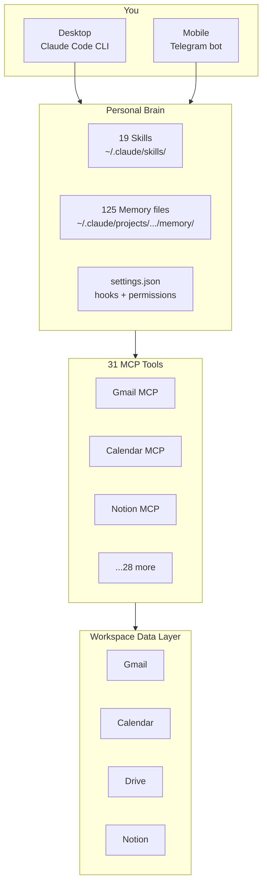

# Setup 1 — Chris's Workspace-Native Claude Code

> **The 30-second pitch.** Claude Code (or "OpenClaw" if you saw the slides) wired into Google Workspace via 31 MCP tools, with 19 reusable Skills and 125 memory files. Mobile access via a Telegram bot. ~150 EUR/month all-in. Saves ~23 hours per week, tracked over 8 weeks.

**Maintained by:** Christoph Erler ([erlerventures.org](https://erlerventures.org))
**Companion deck:** [chris-demo.html](../events/01-2026-05-11-setup-trap/chris-demo.html) (44 slides, body-mapped tool snapshots)
**Pain clusters this addresses:** Setup Itself, Tool Overload, Integration, Pace
**Stack age at Event #1:** v4 alive 6 months, v5 (local-first variant) parallel

---

## Who this is for

- You live inside Google Workspace (Gmail, Calendar, Drive, Docs, Sheets, Meet)
- You want AI everywhere, including on mobile, not just at your desk
- You are fine paying ~150 EUR/month for the convenience
- You are willing to invest 30-60 hours up-front to get the foundation right
- You want to *own* the setup and iterate on it forever, not buy a SaaS

If you want zero ongoing cost and full local sovereignty, look at [Dom's setup](dom-rolodex.md) instead.
If you want a complete opinionated Life OS out of the box, look at [Fabian's setup](fabian-personal-ai.md).

---

## What you need installed

| Tool | Why | Cost |
|---|---|---|
| [Claude Code](https://docs.claude.com/en/docs/claude-code/overview) | The CLI that runs the whole thing | Free |
| Claude Pro or API access | The model itself | 20 USD/mo (Pro) or pay-per-token (API) |
| Google Workspace account | The data layer | What you already pay |
| A Mac, Linux box, or Windows with WSL | Where Claude Code runs | Hardware you have |
| (Optional) AWS Lightsail Frankfurt VM | Telegram bot for mobile | ~10 EUR/mo |
| (Optional) [Deepgram](https://deepgram.com) for transcription | Voice-to-Markdown notes | Pay-per-minute |

Total steady-state: ~150 EUR/month.

---

## The architecture in one diagram



**The five layers, in order of importance:**
1. **Memory files first.** Without them, Claude has no idea who you are or what you do. Markdown files in `~/.claude/projects/.../memory/` capture user, feedback, project, and reference memory.
2. **Skills second.** Each skill is a `SKILL.md` with a description, a "when to trigger", and an instruction set. 19 skills total, ranging from `/morning-brief` to `/legoland-pricing`.
3. **MCP tools third.** Each MCP server is one external system Claude can read or write. 31 of them, mostly Google Workspace.
4. **Hooks fourth.** Defined in `settings.json`. They run on events: PreToolUse, PostToolUse, Stop, UserPromptSubmit. Used for guardrails (e.g. block destructive commands without confirmation).
5. **Telegram bot last.** A small Node service on a Lightsail VM forwards Telegram messages into a Claude Code session. That is what makes this mobile.

---

## Step-by-step to your first win (60 minutes)

### 1. Install Claude Code

```bash
# Mac / Linux
curl -fsSL https://claude.ai/install.sh | bash

# Windows: install WSL first, then use the Mac/Linux command inside WSL
```

Verify: `claude --version` should print a version. Reference: [docs.claude.com/en/docs/claude-code/overview](https://docs.claude.com/en/docs/claude-code/overview).

### 2. Write your first memory file

Create `~/.claude/projects/<your-project>/memory/MEMORY.md`:

```markdown
- [About me](user_about.md) — name, role, what I'm working on this quarter
```

Then create `~/.claude/projects/<your-project>/memory/user_about.md`:

```markdown
---
name: About me
description: Who I am and what I'm working on right now
type: user
---

I am [name]. I run [company]. My current focus is [thing].
My goals this quarter are: [3 bullets].
I hate when AI tools [specific dislike].
```

That's it. Claude now reads this every conversation in that project.

### 3. Connect your first MCP tool — Gmail

The fastest path is Anthropic's connector list. From the Claude Code CLI:

```bash
/mcp
```

Pick **Gmail**, follow the OAuth flow. Verify by asking Claude: *"List my unread emails from today"*.

### 4. Write your first skill

Create `~/.claude/skills/morning-brief/SKILL.md`:

```markdown
---
name: morning-brief
description: Give me a 5-bullet brief on today — calendar, top emails, news. Use whenever I say "morning brief", "what's on today", or "brief me".
---

Pull from:
1. Calendar today (next 8 hours)
2. Gmail unread top 5
3. Any news headlines I subscribed to in /resources/news-feeds.md

Output: 5 bullets max. No fluff. Lead with what needs my decision today.
```

Now type `/morning-brief` in Claude Code. You have a working personal AI.

### 5. (Optional) Mobile via Telegram

This is the longest part of the setup. The short version:
- Spin up an AWS Lightsail VM in Frankfurt (~10 EUR/mo)
- Run a small Node bot that listens to Telegram, forwards messages to a `claude` session, posts replies back
- Use BotFather to create the Telegram bot

Detailed playbook is too long for this file — see [`solutions/setup-itself/30-min-aios-blueprint.md`](../solutions/setup-itself/30-min-aios-blueprint.md) for the abbreviated version.

---

## What hurts (honest struggles)

1. **Memory drift.** Memory files go stale within weeks if you don't audit them. Run a weekly `/audit-memory` skill or the brain runs on lies.
2. **MCP server count.** I run 31. That is too many. Most go untouched for weeks. Start with 5, add only when a real need surfaces.
3. **Skill description quality.** A skill with a bad description never triggers. The trigger sentence in the frontmatter is 80% of the work.
4. **Cost spikes during build-up.** Real number: $50/day Opus burn for 2 to 4 weeks while you are iterating. Steady state is much lower, but plan for the burn.
5. **Vendor roadmap risk.** Anthropic changes the CLI quarterly. Three times in 2026 my settings.json broke on a release. Pin a version if you cannot tolerate that.

---

## What I would do differently if I started over today

(This is the long answer to Slido Q1, condensed.)

1. **Memory before tools.** Write the user/feedback/project memory files on day one. I wasted weeks installing MCP servers before I had any persistent context.
2. **One stack, not five.** I tried v1-v3 in parallel (ChatGPT-only, Notion+Zapier, multi-tool). Only v4 (Workspace-native) survived. Pick one and commit.
3. **Markdown over Vector-DB until you have 10k+ unstructured docs.** The complexity of a vector DB is rarely worth it for a personal brain. Files in folders work shockingly well.
4. **Skills, not custom code.** I built three custom Python helpers in month one. All three got replaced by skills within 90 days. Default to a skill until proven impossible.
5. **No vendor lock-in at the prompt layer.** Every memory file and every skill is plain Markdown. If Anthropic disappeared tomorrow, this would all run on the next provider.

---

## Numbers from real use (8-week tracked sample)

| Activity | Hours saved per week |
|---|---|
| Morning briefing | 2.25h |
| Meeting prep (4 calls/day) | 5.7h |
| Email + WhatsApp drafts | 2.7h |
| Real estate pricing (full auto) | 5.0h |
| Weekly review (90min → 10min) | 1.3h |
| Client diagnostics | 3.0h |
| Deliverables | 3.75h |
| **Total** | **~23h/week** |

Cost: ~150 EUR/mo. Setup time: ~200h up front. Payback: 4-5 months.

---

## Where to read more

- [`SOLUTIONS.md`](../SOLUTIONS.md) — the 11 documented solutions, each tied to an audience pain cluster
- [`solutions/setup-itself/30-min-aios-blueprint.md`](../solutions/setup-itself/30-min-aios-blueprint.md) — the abbreviated 30-minute version of this setup
- [`solutions/openclaw-honest/openclaw-honest-assessment.md`](../solutions/openclaw-honest/openclaw-honest-assessment.md) — what breaks in production (read before you commit)
- [`events/01-2026-05-11-setup-trap/chris-demo.html`](../events/01-2026-05-11-setup-trap/chris-demo.html) — the full body-mapped tour with screenshots

---

*Want to fork the actual skill files? They are not in this public repo (they contain personal data). Use this file as the architecture spec, then build your own. If you get stuck, [open an issue](https://github.com/chris1928a/eo-ai-exchange/issues).*
